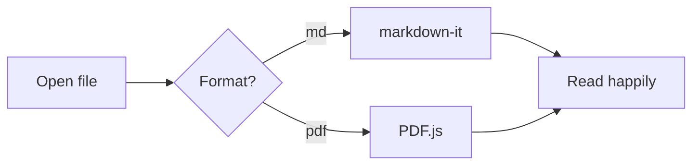

# Markdown Viewer Demo

This document exercises every feature the viewer supports. If everything below looks right, the rendering pipeline is healthy.

## Text formatting

**Bold**, *italic*, ~~strikethrough~~, `inline code`, and a [link to the Markdown guide](https://www.markdownguide.org). Typographer is on, so "smart quotes" and em-dashes -- like this -- are converted automatically.

> Blockquotes work too.
> — including multi-line ones with attribution.

## Code blocks

```javascript
// JavaScript with syntax highlighting
function fibonacci(n) {
  if (n <= 1) return n;
  return fibonacci(n - 1) + fibonacci(n - 2);
}
console.log([...Array(10).keys()].map(fibonacci));
```

```python
# Python too
def greet(name: str) -> str:
    return f"Hello, {name}!"

print(greet("world"))
```

```bash
# Shell commands
brew install something && echo "done"
```

## Tables

| Feature | Status | Notes |
|---|---|---|
| GFM tables | ✅ | You are looking at one |
| Syntax highlighting | ✅ | highlight.js |
| Task lists | ✅ | See below |
| Dark mode | ✅ | Follows macOS setting |

## Task lists

- [x] Build rendering pipeline
- [x] Add table of contents
- [ ] Wrap in a native macOS app
- [ ] Register `.md` file association

## Lists and nesting

1. First ordered item
2. Second item
   - Nested bullet
   - Another one
     1. Deeply nested ordered
3. Third item

## Headings for the TOC

### Subsection A

Some text so the scroll-sync in the table of contents has something to track.

### Subsection B

More filler text. Scroll around and watch the sidebar highlight follow you.

## Mermaid diagram



## Math (KaTeX)

Inline math like $E = mc^2$ works, and so do display equations:

$$\int_{-\infty}^{\infty} e^{-x^2}\,dx = \sqrt{\pi}$$

## Horizontal rule

---

## HTML passthrough (sanitized)

<details>
<summary>Click to expand — details/summary elements work</summary>

Hidden content inside a `details` block. Script tags, on the other hand, are stripped by DOMPurify.

</details>

That's everything. 🎉
